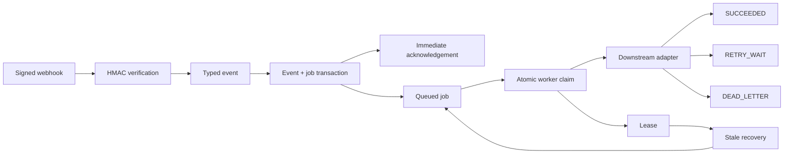
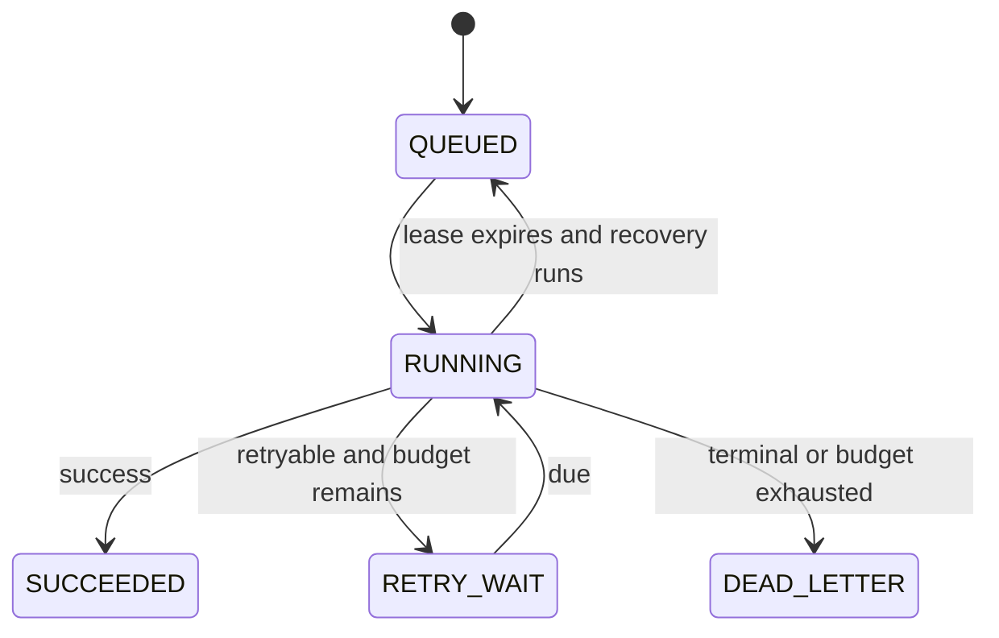

# Reliable Webhook Workflow


A standalone Python 3.11 proof that accepts signed external events quickly, stores each event and its job durably, and processes work asynchronously with bounded retries and crash recovery.

External systems retry deliveries, downstream services fail, and workers can stop mid-job. Doing downstream work inside the request risks slow acknowledgements, lost work, and duplicate effects. This repository demonstrates the reliability boundaries around that workflow using a synthetic order and fulfillment domain—no real payment provider or external service is involved.

## What it demonstrates

- Raw-body HMAC-SHA256 verification and strict typed event validation.
- Duplicate-safe intake: same ID and same contents reuses the job; changed contents return 409.
- Atomic event/job persistence and immediate 202/200 acknowledgement before downstream work.
- SQLite guarded claims, worker leases, stale recovery, bounded retry with jitter, and dead-lettering.
- Persistent per-attempt audit history and deterministic offline tests.

## Architecture



## Workflow state machine



## Reliability invariants

1. Invalid signatures are rejected before persistence.
2. A provider event ID creates at most one logical event and job; changed contents conflict.
3. The webhook handler never invokes downstream work.
4. Event and job records commit in one transaction.
5. Competing workers cannot both claim one due job in this SQLite model.
6. Each started processing attempt has persistent audit history, including recovered crashes.
7. Retryable failures use bounded exponential backoff; terminal failures stop immediately.
8. Exhausted retry budget becomes `DEAD_LETTER`; expired leases can be reclaimed.
9. Tests use fake time and scripted adapters, without sleeps or network access.

## 60-second offline demo

```sh
git clone https://github.com/vantablade-ai/reliable-webhook-workflow.git
cd reliable-webhook-workflow
make install
make demo
```

The demo uses a temporary SQLite database, a synthetic local-only signing key, fixed jitter, and fake clock. It exercises accepted intake, duplicate replay, 409 conflict, 429/500 retry then success, worker crash recovery, and dead-letter exhaustion.

## Webhook authentication

`POST /webhooks/orders` expects `X-Webhook-Signature` to contain the lowercase or uppercase hex HMAC-SHA256 digest of the exact raw body bytes. The configured `WEBHOOK_SECRET` is never persisted. This proof does not implement timestamp replay protection.

## Duplicate delivery and conflict semantics

The canonical validated model is fingerprinted with SHA-256 after key ordering and currency normalization. Repeated ID plus matching fingerprint returns HTTP 200 with the original job ID. Reusing an ID with a changed payload returns HTTP 409 and leaves prior records untouched. The hash is an integrity/idempotency aid, not authentication.

## Worker claims, leases, and recovery

`BEGIN IMMEDIATE` serializes SQLite writers. The repository selects the oldest due job, then performs a guarded update and checks that exactly one row changed. Claim ownership and an expiry timestamp are set together. `make recover` moves expired `RUNNING` jobs back to `QUEUED`, clears ownership, increments recovery metadata, and closes the open attempt as a crash.

## Retry and dead-letter behavior

Timeout, HTTP 429 and HTTP 500/502/503/504 are retryable. Permanent downstream rejection is terminal. Delay is `min(base × 2^(attempt−1), cap) + jitter`; the attempt limit bounds work. `DEAD_LETTER` stops automated processing and records the final reason. No automatic replay endpoint exists.

## Attempt history

`job_attempts` records attempt number, worker, start/finish times, outcome, error code/class, downstream status, and scheduled retry time. A process death leaves an open attempt until lease recovery records it as `CRASH`.

## API and commands

- `POST /webhooks/orders`
- `GET /events/{event_id}`
- `GET /jobs`, `GET /jobs/{job_id}`, `GET /jobs/{job_id}/attempts`
- `GET /health`
- `make run`, `make worker`, `make recover`, `make test`, `make check`

Worker concurrency is bounded by how many worker invocations are run; the sample processes one job at a time. SQLite keeps the proof reproducible and is not presented as a high-throughput distributed queue.

## Engineering decisions and limitations

This proof demonstrates duplicate-safe intake, one logical job per provider event, atomic active claims under SQLite, and recoverable at-least-once worker execution. It does **not** claim exactly-once processing. If a worker dies after an external side effect succeeds but before local success is committed, work may be delivered again. Production downstream effects must support their own idempotency. No throughput benchmark is claimed.

## Repository structure

`app/` contains API, deterministic workflow services, SQLite repository, security, and fake adapter. `schema.sql` defines event, job, and attempt records. `scripts/` contains one-shot worker, recovery, and demo commands; `tests/` exercises core semantics; `docs/architecture.md` explains transaction and recovery choices.
